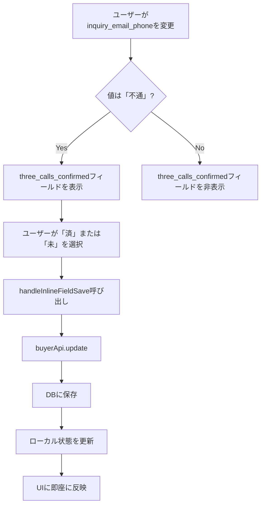

# Design Document

## Overview

買主詳細画面（BuyerDetailPage.tsx）において、「3回架電確認済み」フィールドの表示機能を実装し、全てのボタン形式フィールドのエラーハンドリングを改善します。

### 主要な変更点

1. **「3回架電確認済み」フィールドの条件付き表示**: `inquiry_email_phone`が「不通」の場合にのみ表示
2. **ドロップダウン選択肢の簡素化**: 「済」「未」の2つのみ（既存の3つから削減）
3. **「【問合メール】電話対応」の選択肢変更**: 「過去のもの」ボタンを削除し、「済」「未」「不通」の3つのみに変更
4. **全てのボタン形式フィールドのエラーハンドリング改善**: ボタンクリック時に反応しない問題を修正
5. **データマイグレーション**: 過去の想定外の値を「済」に統一

### 修正対象のボタン形式フィールド

1. **inquiry_email_phone**（【問合メール】電話対応）- 選択肢変更 + エラーハンドリング改善
2. **initial_assignee**（初動担当）- エラーハンドリング改善
3. **distribution_type**（配信の有無）- エラーハンドリング改善
4. **viewing_promotion_email**（内覧促進メール）- デザイン調整（派手な装飾を削除してシンプルに統一）

### 技術的アプローチ

- 既存のインライン編集可能フィールドインフラストラクチャを活用
- Reactの条件付きレンダリングを使用した動的表示制御
- **全てのボタン形式フィールドに統一されたエラーハンドリングパターンを適用**
- データベースレベルでのマイグレーションによる過去データのクリーンアップ

### エラーハンドリングパターン

全てのボタン形式フィールドで以下のパターンを使用：

```typescript
const handleButtonClick = async (newValue: string) => {
  try {
    console.log(`[${field.key}] Button clicked, current value:`, value, 'new value:', newValue);
    
    // 同じボタンを2度クリックしたら値をクリア
    const valueToSave = value === newValue ? '' : newValue;
    console.log(`[${field.key}] Setting value:`, valueToSave);
    
    const result = await handleInlineFieldSave(field.key, valueToSave);
    
    if (result && !result.success && result.error) {
      setSnackbar({
        open: true,
        message: result.error,
        severity: 'error'
      });
    } else {
      setSnackbar({
        open: true,
        message: '保存しました',
        severity: 'success'
      });
    }
  } catch (error: any) {
    console.error(`[${field.key}] Error:`, error);
    setSnackbar({
      open: true,
      message: error.message || '保存に失敗しました',
      severity: 'error'
    });
  }
};
```

**利点**:
1. エラーが発生してもユーザーに通知される
2. 成功時にも通知される（ユーザーフィードバック）
3. デバッグログで問題を追跡できる
4. 全てのボタンで一貫した動作

## Architecture

### コンポーネント構造

```
BuyerDetailPage
├── BUYER_FIELD_SECTIONS (フィールド定義)
│   └── 問合せ内容セクション
│       ├── inquiry_email_phone (【問合メール】電話対応)
│       └── three_calls_confirmed (3回架電確認済み) ← 条件付き表示
│
├── InlineEditableField (既存コンポーネント)
│   ├── fieldType: "dropdown"
│   └── options: THREE_CALLS_CONFIRMED_OPTIONS
│
└── handleInlineFieldSave (保存ハンドラー)
    └── buyerApi.update() → DB更新
```

### データフロー



## Components and Interfaces

### 1. BUYER_FIELD_SECTIONS の更新

**場所**: `BuyerDetailPage.tsx` (135行目付近)

**変更内容**:
- `three_calls_confirmed`フィールドの`conditionalDisplay`プロパティを維持
- 表示条件: `inquiry_email_phone === '不通'`

```typescript
{
  key: 'three_calls_confirmed',
  label: '3回架電確認済み',
  inlineEditable: true,
  fieldType: 'dropdown',
  column: 'left',
  conditionalDisplay: true,  // 条件付き表示を有効化
  required: true  // 必須フィールドとしてマーク
}
```

### 2. 条件付きレンダリングロジック

**場所**: `BuyerDetailPage.tsx` (1540行目付近)

**現在の実装**:
```typescript
// three_calls_confirmedフィールドは削除されました（条件が複雑すぎるため非表示）
if (field.key === 'three_calls_confirmed') {
  // このフィールドは常に非表示
  return null;
}
```

**新しい実装**:
```typescript
// three_calls_confirmedフィールドは条件付き表示
if (field.key === 'three_calls_confirmed') {
  // 表示条件：「【問合メール】電話対応」が「不通」の場合のみ表示
  const shouldDisplay = buyer.inquiry_email_phone === '不通';

  if (!shouldDisplay) {
    return null; // 条件を満たさない場合は表示しない
  }

  const handleFieldSave = async (newValue: any) => {
    const result = await handleInlineFieldSave(field.key, newValue);
    if (result && !result.success && result.error) {
      throw new Error(result.error);
    }
  };

  return (
    <Grid item {...gridSize} key={field.key}>
      <Box 
        sx={{ 
          mb: 1,
          p: 2,
          border: '3px solid',
          borderColor: 'error.main',
          borderRadius: 2,
          bgcolor: 'error.light',
          boxShadow: '0 4px 12px rgba(211, 47, 47, 0.3)',
        }}
      >
        <Typography 
          variant="subtitle2" 
          sx={{ 
            display: 'block', 
            mb: 1,
            fontWeight: 'bold',
            fontSize: '0.95rem',
            color: 'text.primary',
          }}
        >
          {field.label} <span style={{ color: 'red', fontWeight: 'bold' }}>*必須</span>
        </Typography>
        <InlineEditableField
          label=""
          value={value || ''}
          fieldName={field.key}
          fieldType="dropdown"
          options={THREE_CALLS_CONFIRMED_OPTIONS}
          onSave={handleFieldSave}
          buyerId={buyer?.id || buyer_number}
          enableConflictDetection={true}
          showEditIndicator={true}
        />
      </Box>
    </Grid>
  );
}
```

### 3. inquiry_email_phone フィールドの更新

**場所**: `BuyerDetailPage.tsx` (1400行目付近)

**変更内容**:
- 「過去のもの」ボタンを削除
- 選択肢を「済」「未」「不通」の3つのみに変更
- **ボタンクリック時のエラーハンドリングを改善**（反応しない問題を修正）

**問題**: 現在の実装では、`handleFieldSave`が非同期関数ですが、エラーハンドリングが不十分で、ボタンクリック時に反応しない場合があります。

**解決策**: エラーハンドリングを追加し、成功時にスナックバーで通知します。

```typescript
// inquiry_email_phoneフィールドは特別処理（条件付き表示・ボタン形式）
if (field.key === 'inquiry_email_phone') {
  // 表示条件：「問合せ元」に"メール"が含まれる場合のみ表示
  const shouldDisplay = buyer.inquiry_source && buyer.inquiry_source.includes('メール');

  if (!shouldDisplay) {
    return null;
  }

  const handleButtonClick = async (newValue: string) => {
    try {
      console.log('[inquiry_email_phone] Button clicked, current value:', value, 'new value:', newValue);
      
      // 同じボタンを2度クリックしたら値をクリア
      const valueToSave = value === newValue ? '' : newValue;
      console.log('[inquiry_email_phone] Setting value:', valueToSave);
      
      const result = await handleInlineFieldSave(field.key, valueToSave);
      
      if (result && !result.success && result.error) {
        setSnackbar({
          open: true,
          message: result.error,
          severity: 'error'
        });
      } else {
        setSnackbar({
          open: true,
          message: '保存しました',
          severity: 'success'
        });
      }
    } catch (error: any) {
      console.error('[inquiry_email_phone] Error:', error);
      setSnackbar({
        open: true,
        message: error.message || '保存に失敗しました',
        severity: 'error'
      });
    }
  };

  // 標準的な選択肢（「過去のもの」を削除）
  const standardOptions = ['済', '未', '不通'];
  const isStandardValue = standardOptions.includes(value);

  return (
    <Grid item {...gridSize} key={field.key}>
      <Box sx={{ mb: 1 }}>
        <Typography variant="caption" color="text.primary" sx={{ display: 'block', mb: 0.5 }}>
          {field.label}
        </Typography>
        {isStandardValue || !value ? (
          // 標準的な値または空の場合はボタンを表示
          <Box sx={{ display: 'flex', gap: 1, flexWrap: 'wrap' }}>
            {standardOptions.map((option) => (
              <Button
                key={option}
                variant={value === option ? 'contained' : 'outlined'}
                color="primary"
                size="small"
                onClick={() => handleButtonClick(option)}
                sx={{ flex: '1 1 auto', minWidth: '60px' }}
              >
                {option}
              </Button>
            ))}
          </Box>
        ) : (
          // 想定外の値の場合はテキストとして表示
          <Box sx={{ 
            p: 1, 
            border: '1px solid', 
            borderColor: 'warning.main',
            borderRadius: 1,
            bgcolor: 'warning.light',
            display: 'flex',
            alignItems: 'center',
            justifyContent: 'space-between'
          }}>
            <Typography variant="body2" sx={{ fontWeight: 'bold' }}>
              {value}
            </Typography>
            <Button
              variant="outlined"
              size="small"
              onClick={async () => {
                try {
                  const result = await handleInlineFieldSave(field.key, '');
                  if (result && !result.success && result.error) {
                    setSnackbar({
                      open: true,
                      message: result.error,
                      severity: 'error'
                    });
                  } else {
                    setSnackbar({
                      open: true,
                      message: 'クリアしました',
                      severity: 'success'
                    });
                  }
                } catch (error: any) {
                  setSnackbar({
                    open: true,
                    message: error.message || 'クリアに失敗しました',
                    severity: 'error'
                  });
                }
              }}
              sx={{ ml: 1 }}
            >
              クリア
            </Button>
          </Box>
        )}
      </Box>
    </Grid>
  );
}
```

### 4. buyerFieldOptions.ts の更新

**場所**: `frontend/src/utils/buyerFieldOptions.ts`

**変更内容**:
- `THREE_CALLS_CONFIRMED_OPTIONS`を「済」「未」の2つのみに変更
- `INQUIRY_EMAIL_PHONE_OPTIONS`から「過去のもの」を削除（コード内で直接定義するため不要）

```typescript
/**
 * 3回架電確認済みの選択肢
 */
export const THREE_CALLS_CONFIRMED_OPTIONS: FieldOption[] = [
  { value: '済', label: '済' },
  { value: '未', label: '未' },
];
```

### 5. initial_assignee フィールドの更新

**場所**: `BuyerDetailPage.tsx` (1548行目付近)

**変更内容**:
- エラーハンドリングを改善（ボタンクリック時に反応しない問題を修正）

```typescript
// initial_assigneeフィールドは特別処理（スタッフイニシャルボタン形式）
if (field.key === 'initial_assignee') {
  const handleButtonClick = async (newValue: string) => {
    try {
      console.log('[initial_assignee] Button clicked, current value:', value, 'new value:', newValue);
      
      // 同じボタンを2度クリックしたら値をクリア
      const valueToSave = value === newValue ? '' : newValue;
      console.log('[initial_assignee] Setting value:', valueToSave);
      
      const result = await handleInlineFieldSave(field.key, valueToSave);
      
      if (result && !result.success && result.error) {
        setSnackbar({
          open: true,
          message: result.error,
          severity: 'error'
        });
      } else {
        setSnackbar({
          open: true,
          message: '保存しました',
          severity: 'success'
        });
      }
    } catch (error: any) {
      console.error('[initial_assignee] Error:', error);
      setSnackbar({
        open: true,
        message: error.message || '保存に失敗しました',
        severity: 'error'
      });
    }
  };

  return (
    <Grid item {...gridSize} key={field.key}>
      <Box sx={{ mb: 1 }}>
        <Typography variant="caption" color="text.secondary" sx={{ display: 'block', mb: 0.5 }}>
          {field.label}
        </Typography>
        <Box sx={{ display: 'flex', gap: 0.5, flexWrap: 'wrap' }}>
          {staffInitials.map((initial) => (
            <Button
              key={initial}
              variant={value === initial ? 'contained' : 'outlined'}
              color="primary"
              size="small"
              onClick={() => handleButtonClick(initial)}
              sx={{ 
                minWidth: '40px',
                padding: '4px 8px',
                fontSize: '0.75rem',
              }}
            >
              {initial}
            </Button>
          ))}
        </Box>
      </Box>
    </Grid>
  );
}
```

### 6. distribution_type フィールドの更新

**場所**: `BuyerDetailPage.tsx` (1933行目付近)

**変更内容**:
- エラーハンドリングを改善（ボタンクリック時に反応しない問題を修正）

```typescript
// distribution_typeフィールドは特別処理（ボタン形式）
if (field.key === 'distribution_type') {
  const handleButtonClick = async (newValue: string) => {
    try {
      console.log('[distribution_type] Button clicked, current value:', value, 'new value:', newValue);
      
      // 同じボタンを2度クリックしたら値をクリア
      const valueToSave = value === newValue ? '' : newValue;
      console.log('[distribution_type] Setting value:', valueToSave);
      
      const result = await handleInlineFieldSave(field.key, valueToSave);
      
      if (result && !result.success && result.error) {
        setSnackbar({
          open: true,
          message: result.error,
          severity: 'error'
        });
      } else {
        setSnackbar({
          open: true,
          message: '保存しました',
          severity: 'success'
        });
      }
    } catch (error: any) {
      console.error('[distribution_type] Error:', error);
      setSnackbar({
        open: true,
        message: error.message || '保存に失敗しました',
        severity: 'error'
      });
    }
  };

  return (
    <Grid item {...gridSize} key={field.key}>
      <Box sx={{ mb: 1 }}>
        <Typography variant="caption" color="text.secondary" sx={{ display: 'block', mb: 0.5 }}>
          {field.label}
        </Typography>
        <Box sx={{ display: 'flex', gap: 1 }}>
          <Button
            variant={value === '要' ? 'contained' : 'outlined'}
            color="primary"
            size="small"
            onClick={() => handleButtonClick('要')}
            sx={{ flex: 1 }}
          >
            要
          </Button>
          <Button
            variant={value === '不要' ? 'contained' : 'outlined'}
            color="primary"
            size="small"
            onClick={() => handleButtonClick('不要')}
            sx={{ flex: 1 }}
          >
            不要
          </Button>
        </Box>
      </Box>
    </Grid>
  );
}
```

### 7. viewing_promotion_email フィールドのデザイン調整

**場所**: `BuyerDetailPage.tsx` (1760行目付近)

**変更内容**:
- 派手な装飾を削除してシンプルなデザインに統一
- `three_calls_confirmed`フィールドと同じデザインパターンを適用

**変更前の問題**:
- オレンジ色の枠線（`border: '3px solid'`、`borderColor: 'warning.main'`）
- 影（`boxShadow: '0 4px 12px rgba(237, 108, 2, 0.3)'`）
- 条件付きスタイル変更（`hasValue`による動的なスタイル）
- 大きいボタン（`size="large"`）
- 派手な色（`color="success"`/`color="error"`）
- カスタムスタイル（`fontWeight`、`fontSize`、`py`、`bgcolor`、`borderWidth`など）

**変更後**:
```typescript
// viewing_promotion_emailフィールドは条件付き表示（ボタン形式）
if (field.key === 'viewing_promotion_email') {
  // 表示条件：「問合せ元」に"メール"が含まれる場合のみ表示
  const shouldDisplay = buyer.inquiry_source && buyer.inquiry_source.includes('メール');

  if (!shouldDisplay) {
    return null; // 条件を満たさない場合は表示しない
  }

  const handleButtonClick = async (newValue: string) => {
    try {
      console.log('[viewing_promotion_email] Button clicked, current value:', value, 'new value:', newValue);
      
      // 同じボタンを2度クリックしたら値をクリア
      const valueToSave = value === newValue ? '' : newValue;
      console.log('[viewing_promotion_email] Setting value:', valueToSave);
      
      const result = await handleInlineFieldSave(field.key, valueToSave);
      
      if (result && !result.success && result.error) {
        setSnackbar({
          open: true,
          message: result.error,
          severity: 'error'
        });
      }
    } catch (error: any) {
      console.error('[viewing_promotion_email] Error:', error);
      setSnackbar({
        open: true,
        message: error.message || '保存に失敗しました',
        severity: 'error'
      });
    }
  };

  return (
    <Grid item {...gridSize} key={field.key}>
      <Box sx={{ mb: 1 }}>
        <Typography variant="caption" color="text.primary" sx={{ display: 'block', mb: 0.5 }}>
          {field.label}
        </Typography>
        <Box sx={{ display: 'flex', gap: 1 }}>
          <Button
            variant={value === '要' ? 'contained' : 'outlined'}
            color="primary"
            size="small"
            onClick={() => handleButtonClick('要')}
            sx={{ flex: 1 }}
          >
            要
          </Button>
          <Button
            variant={value === '不要' ? 'contained' : 'outlined'}
            color="primary"
            size="small"
            onClick={() => handleButtonClick('不要')}
            sx={{ flex: 1 }}
          >
            不要
          </Button>
        </Box>
      </Box>
    </Grid>
  );
}
```

**デザイン変更のポイント**:
1. ✅ **派手な装飾を削除**: オレンジ色の枠線、影、条件付きスタイル変更を削除
2. ✅ **シンプルなボックス**: `mb: 1`のみのシンプルなBox
3. ✅ **小さいボタン**: `size="small"`、`color="primary"`
4. ✅ **控えめなスタイル**: 特別な装飾なし
5. ✅ **成功時のスナックバーを削除**: エラー時のみ通知（`three_calls_confirmed`と同じパターン）
6. ✅ **他のフィールドと調和**: 統一されたデザインで視覚的な調和を実現

## Data Models

### buyers テーブル

**既存カラム**:
- `three_calls_confirmed` (TEXT): 3回架電確認済みの状態
- `inquiry_email_phone` (TEXT): 【問合メール】電話対応の状態

**データ型**: TEXT（柔軟性のため）

**想定される値**:
- `three_calls_confirmed`: "済", "未", NULL
- `inquiry_email_phone`: "済", "未", "不通", NULL

### データマイグレーション

**目的**: 過去に入力された想定外の値を「済」に統一

**対象フィールド**:
1. `inquiry_email_phone`: 「済」「未」「不通」以外の値を「済」に変換
2. `three_calls_confirmed`: 「済」「未」以外の値を「済」に変換

**マイグレーションSQL**:
```sql
-- inquiry_email_phoneの想定外の値を「済」に変換
UPDATE buyers
SET inquiry_email_phone = '済'
WHERE inquiry_email_phone IS NOT NULL
  AND inquiry_email_phone NOT IN ('済', '未', '不通');

-- three_calls_confirmedの想定外の値を「済」に変換
UPDATE buyers
SET three_calls_confirmed = '済'
WHERE three_calls_confirmed IS NOT NULL
  AND three_calls_confirmed NOT IN ('済', '未');
```

## Correctness Properties

*プロパティとは、システムの全ての有効な実行において真であるべき特性や動作のことです。プロパティは人間が読める仕様と機械で検証可能な正確性保証の橋渡しとなります。*

### Property 1: 条件付き表示の一貫性

*For any* buyer状態において、`inquiry_email_phone`が「不通」の場合に限り、`three_calls_confirmed`フィールドが表示され、それ以外の場合は非表示になるべきです。

**Validates: Requirements 1.1, 1.2**

### Property 2: ドロップダウンコンポーネントのレンダリング

*For any* 表示されている`three_calls_confirmed`フィールドにおいて、それはドロップダウンコンポーネントとしてレンダリングされ、必須フィールドとして視覚的に強調表示（赤い枠線）されるべきです。

**Validates: Requirements 1.3, 1.4**

### Property 3: 選択肢の即時更新

*For any* ドロップダウンからの選択において、選択された値は即座にフィールド値として更新され、UIに反映されるべきです。

**Validates: Requirements 2.2, 2.3**

### Property 4: データ永続化のラウンドトリップ

*For any* 選択された値（「済」または「未」）において、その値を保存してからページをリロードした場合、同じ値が正しく取得され表示されるべきです。

**Validates: Requirements 3.1, 3.2**

### Property 5: エラーハンドリング

*For any* 保存操作の失敗において、エラーメッセージが表示され、フィールド値は前の値に戻るべきです。

**Validates: Requirements 3.3**

### Property 6: 他フィールドへの影響なし

*For any* `three_calls_confirmed`フィールドの表示/非表示の変更において、他のフィールドの表示動作は変更されないべきです。

**Validates: Requirements 4.1**

### Property 7: リアクティブな表示更新

*For any* `inquiry_email_phone`の値変更において、ページリロードなしで`three_calls_confirmed`フィールドの表示/非表示が即座に更新されるべきです。

**Validates: Requirements 4.3**

## Error Handling

### 1. 保存エラー

**シナリオ**: データベース更新が失敗した場合

**処理**:
1. エラーメッセージをスナックバーで表示
2. フィールド値を前の値に戻す
3. ユーザーに再試行を促す

**実装**: 全てのボタン形式フィールドで統一されたエラーハンドリングパターンを使用

```typescript
const handleButtonClick = async (newValue: string) => {
  try {
    const result = await handleInlineFieldSave(field.key, valueToSave);
    
    if (result && !result.success && result.error) {
      setSnackbar({
        open: true,
        message: result.error,
        severity: 'error'
      });
    } else {
      setSnackbar({
        open: true,
        message: '保存しました',
        severity: 'success'
      });
    }
  } catch (error: any) {
    setSnackbar({
      open: true,
      message: error.message || '保存に失敗しました',
      severity: 'error'
    });
  }
};
```

### 2. 想定外の値

**シナリオ**: データベースに想定外の値が保存されている場合

**処理**:
1. マイグレーションで事前にクリーンアップ
2. UIでは想定外の値を警告付きで表示
3. ユーザーがクリアボタンで値をリセット可能

**実装**: `inquiry_email_phone`フィールドの既存実装を参照

### 3. ネットワークエラー

**シナリオ**: API呼び出しが失敗した場合

**処理**:
1. エラーメッセージを表示
2. 前の値を維持
3. ユーザーに再試行を促す

### 4. ボタンが反応しない問題の修正

**問題**: 現在の実装では、非同期関数`handleFieldSave`がエラーをthrowするが、キャッチされない

**原因**:
```typescript
// ❌ 問題のあるコード
const handleFieldSave = async (newValue: any) => {
  const result = await handleInlineFieldSave(field.key, newValue);
  if (result && !result.success && result.error) {
    throw new Error(result.error);  // エラーがキャッチされない
  }
};

onClick={() => {
  handleFieldSave(option);  // awaitもtry-catchもない
}}
```

**解決策**: try-catchブロックでエラーをキャッチし、スナックバーで通知

```typescript
// ✅ 修正後のコード
const handleButtonClick = async (newValue: string) => {
  try {
    const result = await handleInlineFieldSave(field.key, valueToSave);
    
    if (result && !result.success && result.error) {
      setSnackbar({ open: true, message: result.error, severity: 'error' });
    } else {
      setSnackbar({ open: true, message: '保存しました', severity: 'success' });
    }
  } catch (error: any) {
    setSnackbar({ open: true, message: error.message || '保存に失敗しました', severity: 'error' });
  }
};

onClick={() => handleButtonClick(option)}
```

## Testing Strategy

### Unit Tests

**対象**: 個別のコンポーネントとロジック

**テストケース**:
1. **条件付き表示ロジック**:
   - `inquiry_email_phone`が「不通」の場合、`three_calls_confirmed`が表示される
   - `inquiry_email_phone`が「済」の場合、`three_calls_confirmed`が非表示になる
   - `inquiry_email_phone`が「未」の場合、`three_calls_confirmed`が非表示になる
   - `inquiry_email_phone`がNULLの場合、`three_calls_confirmed`が非表示になる

2. **ドロップダウン選択肢**:
   - `THREE_CALLS_CONFIRMED_OPTIONS`が正確に2つの選択肢を持つ
   - 選択肢が「済」と「未」である

3. **エラーハンドリング**:
   - 保存失敗時にエラーメッセージが表示される
   - 保存失敗時に前の値が維持される
   - 保存成功時に成功メッセージが表示される

4. **ボタンクリック動作**:
   - `inquiry_email_phone`ボタンをクリックすると値が更新される
   - `initial_assignee`ボタンをクリックすると値が更新される
   - `distribution_type`ボタンをクリックすると値が更新される
   - 同じボタンを2度クリックすると値がクリアされる

5. **選択肢の変更**:
   - `inquiry_email_phone`の選択肢が「済」「未」「不通」の3つのみである
   - 「過去のもの」ボタンが表示されない

### Property-Based Tests

**対象**: 全ての入力に対する普遍的なプロパティ

**設定**: 各テストは最低100回の反復実行

**テストケース**:

1. **Property 1: 条件付き表示の一貫性**
   - **Tag**: Feature: buyer-three-calls-confirmed-display-fix, Property 1: 条件付き表示の一貫性
   - **Generator**: ランダムなbuyer状態（inquiry_email_phoneの値をランダムに生成）
   - **Property**: `inquiry_email_phone === '不通'` ⟺ `three_calls_confirmed`が表示される

2. **Property 2: ドロップダウンコンポーネントのレンダリング**
   - **Tag**: Feature: buyer-three-calls-confirmed-display-fix, Property 2: ドロップダウンコンポーネントのレンダリング
   - **Generator**: `inquiry_email_phone = '不通'`のbuyer状態
   - **Property**: `three_calls_confirmed`フィールドがドロップダウンとしてレンダリングされ、赤い枠線を持つ

3. **Property 3: 選択肢の即時更新**
   - **Tag**: Feature: buyer-three-calls-confirmed-display-fix, Property 3: 選択肢の即時更新
   - **Generator**: ランダムな選択肢（「済」または「未」）
   - **Property**: 選択後、フィールド値が即座に更新される

4. **Property 4: データ永続化のラウンドトリップ**
   - **Tag**: Feature: buyer-three-calls-confirmed-display-fix, Property 4: データ永続化のラウンドトリップ
   - **Generator**: ランダムな値（「済」または「未」）
   - **Property**: 保存→取得した値が元の値と一致する

5. **Property 5: エラーハンドリング**
   - **Tag**: Feature: buyer-three-calls-confirmed-display-fix, Property 5: エラーハンドリング
   - **Generator**: 保存失敗をシミュレート
   - **Property**: エラーメッセージが表示され、前の値が維持される

6. **Property 6: 他フィールドへの影響なし**
   - **Tag**: Feature: buyer-three-calls-confirmed-display-fix, Property 6: 他フィールドへの影響なし
   - **Generator**: ランダムなbuyer状態
   - **Property**: `three_calls_confirmed`の表示/非表示が他のフィールドの表示に影響しない

7. **Property 7: リアクティブな表示更新**
   - **Tag**: Feature: buyer-three-calls-confirmed-display-fix, Property 7: リアクティブな表示更新
   - **Generator**: `inquiry_email_phone`の値をランダムに変更
   - **Property**: ページリロードなしで`three_calls_confirmed`の表示/非表示が即座に更新される

### Integration Tests

**対象**: コンポーネント間の連携

**テストケース**:
1. **フィールド表示とデータ保存の統合**:
   - `inquiry_email_phone`を「不通」に変更
   - `three_calls_confirmed`が表示されることを確認
   - 「済」を選択
   - データベースに保存されることを確認
   - ページをリロード
   - 「済」が表示されることを確認

2. **マイグレーション後のデータ整合性**:
   - マイグレーションを実行
   - 想定外の値が「済」に変換されていることを確認
   - UIで正しく表示されることを確認

### Manual Testing

**対象**: ユーザー体験とビジュアル確認

**テストケース**:
1. **視覚的な強調表示**:
   - `inquiry_email_phone`を「不通」に設定
   - `three_calls_confirmed`フィールドが赤い枠線で表示されることを確認
   - 必須マーク（*必須）が表示されることを確認

2. **ドロップダウンの操作性**:
   - ドロップダウンをクリック
   - 「済」と「未」の2つの選択肢が表示されることを確認
   - 選択肢を選択
   - 即座に値が更新されることを確認

3. **エラーメッセージの表示**:
   - ネットワークを切断
   - 値を変更
   - エラーメッセージが表示されることを確認

4. **全てのボタンの動作確認**:
   - `inquiry_email_phone`の各ボタン（「済」「未」「不通」）をクリック
   - `initial_assignee`の各ボタン（スタッフイニシャル）をクリック
   - `distribution_type`の各ボタン（「要」「不要」）をクリック
   - 全てのボタンが正しく反応することを確認
   - 成功メッセージが表示されることを確認

5. **選択肢の変更確認**:
   - `inquiry_email_phone`に「過去のもの」ボタンが表示されないことを確認
   - 「済」「未」「不通」の3つのボタンのみが表示されることを確認

## Migration Strategy

### Phase 1: データマイグレーション

**目的**: 過去データのクリーンアップ

**手順**:
1. マイグレーションSQLファイルを作成
2. 本番環境で実行前にステージング環境でテスト
3. 影響を受けるレコード数を確認
4. 本番環境で実行

**マイグレーションファイル**: `backend/migrations/XXX_cleanup_buyer_field_values.sql`

### Phase 2: フロントエンド更新

**目的**: UIの変更を適用

**手順**:
1. `buyerFieldOptions.ts`を更新
2. `BuyerDetailPage.tsx`の条件付きレンダリングロジックを更新
3. ローカル環境でテスト
4. ステージング環境でテスト
5. 本番環境にデプロイ

### Phase 3: 検証

**目的**: 変更が正しく動作することを確認

**手順**:
1. 本番環境で手動テスト
2. エラーログを監視
3. ユーザーフィードバックを収集

## Notes

### 既存コードとの互換性

- `InlineEditableField`コンポーネントを再利用
- `handleInlineFieldSave`ハンドラーを再利用
- 既存のフィールド定義構造（`BUYER_FIELD_SECTIONS`）を維持
- **全てのボタン形式フィールドで統一されたエラーハンドリングパターンを使用**

### パフォーマンス考慮事項

- 条件付きレンダリングはReactの標準機能を使用（パフォーマンスへの影響は最小限）
- データベース更新は既存のAPIを使用（追加のオーバーヘッドなし）
- エラーハンドリングの追加によるパフォーマンスへの影響は無視できる程度

### 将来の拡張性

- 他のフィールドでも同様の条件付き表示ロジックを適用可能
- ドロップダウン選択肢の変更は`buyerFieldOptions.ts`で一元管理
- **統一されたエラーハンドリングパターンにより、新しいボタン形式フィールドの追加が容易**

### ボタンが反応しない問題の根本原因

**問題**: 非同期関数のエラーハンドリングが不十分

**影響を受けるフィールド**:
1. `inquiry_email_phone`（【問合メール】電話対応）
2. `initial_assignee`（初動担当）
3. `distribution_type`（配信の有無）

**修正済みのフィールド**:
- `viewing_promotion_email`（内覧促進メール）- 既に正しいエラーハンドリングを実装済み

**修正方法**: `viewing_promotion_email`の実装パターンを他の全てのボタン形式フィールドに適用

