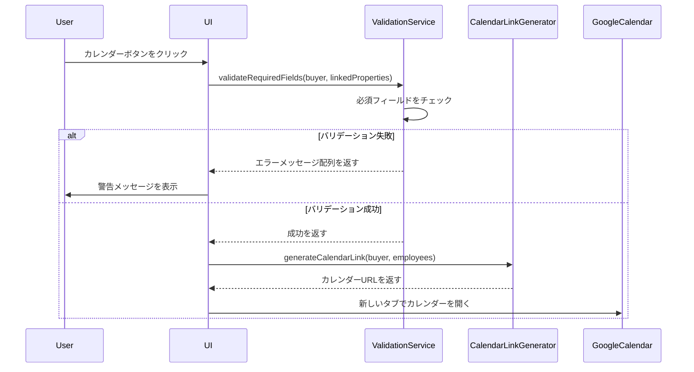

# Design Document

## Overview

買主リストの内覧ページ（BuyerViewingResultPage）に、「カレンダーで開く」ボタンをクリックする前に必須フィールドの入力を検証する機能を追加します。この機能により、不完全な情報でカレンダー登録が行われることを防ぎ、データの整合性を保ちます。

## Architecture

### システム構成

```
BuyerViewingResultPage (React Component)
  ├─ ValidationService (新規作成)
  │   ├─ validateRequiredFields()
  │   └─ getValidationErrors()
  ├─ CalendarLinkGenerator (既存機能の改善)
  │   └─ generateCalendarLink()
  └─ UI Components
      ├─ Calendar Button (既存)
      ├─ Validation Alert (新規)
      └─ Required Field Indicators (新規)
```

### データフロー



## Components and Interfaces

### 1. ValidationService

必須フィールドのバリデーションを担当するサービス。

```typescript
interface ValidationResult {
  isValid: boolean;
  errors: string[];
}

interface RequiredFields {
  latest_viewing_date: string;
  viewing_time: string;
  viewing_mobile: string;  // 内覧形態（専任）または内覧形態_一般媒介
  follow_up_assignee: string;
}

class ValidationService {
  /**
   * 必須フィールドのバリデーションを実行
   * @param buyer - 買主データ
   * @param linkedProperties - 紐づいた物件データ
   * @returns バリデーション結果
   */
  static validateRequiredFields(
    buyer: Buyer,
    linkedProperties: Property[]
  ): ValidationResult {
    const errors: string[] = [];

    // 内覧日のチェック
    if (!buyer.latest_viewing_date || buyer.latest_viewing_date.trim() === '') {
      errors.push('内覧日（最新）');
    }

    // 時間のチェック
    if (!buyer.viewing_time || buyer.viewing_time.trim() === '') {
      errors.push('時間');
    }

    // 内覧形態のチェック（物件タイプに応じて）
    const hasExclusiveProperty = linkedProperties.some(
      (property) => property.atbb_status && property.atbb_status.includes('専任')
    );
    const hasGeneralProperty = linkedProperties.some(
      (property) => property.atbb_status && property.atbb_status.includes('一般')
    );

    if (hasExclusiveProperty || hasGeneralProperty) {
      if (!buyer.viewing_mobile || buyer.viewing_mobile.trim() === '') {
        if (hasExclusiveProperty) {
          errors.push('内覧形態');
        } else {
          errors.push('内覧形態_一般媒介');
        }
      }
    }

    // 後続担当のチェック
    if (!buyer.follow_up_assignee || buyer.follow_up_assignee.trim() === '') {
      errors.push('後続担当');
    }

    return {
      isValid: errors.length === 0,
      errors,
    };
  }

  /**
   * エラーメッセージを生成
   * @param errors - エラーフィールド名の配列
   * @returns ユーザー向けエラーメッセージ
   */
  static getValidationErrorMessage(errors: string[]): string {
    if (errors.length === 0) return '';
    if (errors.length === 1) return `${errors[0]}が未入力です`;
    return `${errors.join('、')}が未入力です`;
  }
}
```


### 2. CalendarLinkGenerator

カレンダーリンクを生成するサービス（既存機能の改善）。

```typescript
interface CalendarEventData {
  title: string;
  startDate: Date;
  endDate: Date;
  details: string;
  assigneeEmail: string;
}

class CalendarLinkGenerator {
  /**
   * Googleカレンダーリンクを生成
   * @param buyer - 買主データ
   * @param employees - 従業員データ
   * @returns Googleカレンダーのイベント作成URL
   */
  static generateCalendarLink(buyer: Buyer, employees: Employee[]): string {
    // 内覧日時を取得
    const viewingDate = new Date(buyer.latest_viewing_date);
    const viewingTime = buyer.viewing_time || '14:00';
    
    // 時間をパース
    const [hours, minutes] = viewingTime.split(':').map(Number);
    viewingDate.setHours(hours, minutes, 0, 0);
    
    // 終了時刻（1時間後）
    const endDate = new Date(viewingDate);
    endDate.setHours(viewingDate.getHours() + 1);
    
    // 日時フォーマット
    const startDateStr = this.formatDateForCalendar(viewingDate);
    const endDateStr = this.formatDateForCalendar(endDate);
    
    // イベントタイトル
    const title = encodeURIComponent(`内覧: ${buyer.name || buyer.buyer_number}`);
    
    // 詳細情報
    const details = encodeURIComponent(
      `買主名: ${buyer.name || buyer.buyer_number}\n` +
      `買主番号: ${buyer.buyer_number}\n` +
      `電話: ${buyer.phone_number || 'なし'}\n` +
      `メール: ${buyer.email || 'なし'}\n` +
      `\n` +
      `買主詳細ページ:\n${window.location.origin}/buyers/${buyer.buyer_number}\n` +
      `\n` +
      `内覧前伝達事項: ${buyer.pre_viewing_notes || 'なし'}`
    );
    
    // 後続担当のメールアドレスを取得
    const assignedEmployee = employees.find(e => 
      e.name === buyer.follow_up_assignee || 
      e.initials === buyer.follow_up_assignee || 
      e.email === buyer.follow_up_assignee
    );
    const assignedEmail = assignedEmployee?.email || '';
    
    // 後続担当のカレンダーに直接作成（srcパラメータを使用）
    const srcParam = assignedEmail ? `&src=${encodeURIComponent(assignedEmail)}` : '';
    
    return `https://calendar.google.com/calendar/render?action=TEMPLATE&text=${title}&dates=${startDateStr}/${endDateStr}&details=${details}${srcParam}`;
  }

  /**
   * Googleカレンダー用の日時フォーマット（YYYYMMDDTHHmmss）
   */
  private static formatDateForCalendar(date: Date): string {
    const year = date.getFullYear();
    const month = String(date.getMonth() + 1).padStart(2, '0');
    const day = String(date.getDate()).padStart(2, '0');
    const hour = String(date.getHours()).padStart(2, '0');
    const minute = String(date.getMinutes()).padStart(2, '0');
    const second = String(date.getSeconds()).padStart(2, '0');
    return `${year}${month}${day}T${hour}${minute}${second}`;
  }
}
```

### 3. UI Components

#### Calendar Button with Validation

カレンダーボタンにバリデーション機能を追加。

```typescript
// BuyerViewingResultPage.tsx内の実装

const handleCalendarButtonClick = () => {
  // バリデーション実行
  const validationResult = ValidationService.validateRequiredFields(
    buyer,
    linkedProperties
  );

  // バリデーション失敗時
  if (!validationResult.isValid) {
    const errorMessage = ValidationService.getValidationErrorMessage(
      validationResult.errors
    );
    
    // スナックバーで警告メッセージを表示
    setSnackbar({
      open: true,
      message: errorMessage,
      severity: 'warning',
    });
    
    return; // カレンダーを開かない
  }

  // バリデーション成功時：カレンダーリンクを生成して開く
  const calendarUrl = CalendarLinkGenerator.generateCalendarLink(buyer, employees);
  window.open(calendarUrl, '_blank');
};
```

#### Required Field Indicators

必須フィールドに視覚的なインジケーターを追加。

```typescript
// 必須フィールドのスタイル
const getRequiredFieldStyle = (fieldValue: string | undefined, isRequired: boolean) => {
  if (!isRequired) return {};
  
  const hasValue = fieldValue && fieldValue.trim() !== '';
  
  return {
    p: hasValue ? 0 : 1,
    border: hasValue ? 'none' : '2px solid',
    borderColor: hasValue ? 'transparent' : 'error.main',
    borderRadius: 2,
    bgcolor: hasValue ? 'transparent' : 'rgba(255, 205, 210, 0.3)',
    boxShadow: hasValue ? 'none' : '0 2px 8px rgba(211, 47, 47, 0.2)',
    transition: 'all 0.3s ease',
  };
};
```

## Data Models

### Buyer Interface

```typescript
interface Buyer {
  buyer_number: string;
  name?: string;
  phone_number?: string;
  email?: string;
  latest_viewing_date?: string;  // 必須フィールド
  viewing_time?: string;         // 必須フィールド
  viewing_mobile?: string;       // 必須フィールド（条件付き）
  follow_up_assignee?: string;   // 必須フィールド
  pre_viewing_notes?: string;
  viewing_result_follow_up?: string;
  latest_status?: string;
  offer_status?: string;
  offer_comment?: string;
  offer_property_sheet?: string;
  offer_lost_comment?: string;
  offer_lost_chat?: string;
  viewing_unconfirmed?: string;
}
```

### Property Interface

```typescript
interface Property {
  property_number: string;
  atbb_status?: string;  // 「専任」または「一般」を含む
  address?: string;
  property_type?: string;
  sales_price?: number;
  // ... その他のフィールド
}
```

### Employee Interface

```typescript
interface Employee {
  name: string;
  initials: string;
  email: string;
  // ... その他のフィールド
}
```


## Correctness Properties

プロパティとは、システムの全ての有効な実行において真であるべき特性や動作のことです。プロパティは、人間が読める仕様と機械で検証可能な正確性保証の橋渡しとなります。

### Property 1: 必須フィールドの完全性チェック

*For any* 買主データと紐づいた物件データの組み合わせにおいて、全ての必須フィールド（内覧日、時間、内覧形態、後続担当）が空の場合、バリデーションは失敗し、エラーリストに全てのフィールド名が含まれるべきです。

**Validates: Requirements 1.4, 2.2, 7.1**

### Property 2: 専任物件の内覧形態必須チェック

*For any* 買主データと、atbb_statusに「専任」を含む物件データにおいて、viewing_mobileフィールドが空の場合、バリデーションは失敗し、エラーリストに「内覧形態」が含まれるべきです。

**Validates: Requirements 1.2, 7.2**

### Property 3: 一般媒介物件の内覧形態必須チェック

*For any* 買主データと、atbb_statusに「一般」を含む物件データにおいて、viewing_mobileフィールドが空の場合、バリデーションは失敗し、エラーリストに「内覧形態_一般媒介」が含まれるべきです。

**Validates: Requirements 1.3, 7.2**

### Property 4: バリデーション成功時のカレンダー開放

*For any* 全ての必須フィールドが入力されている買主データにおいて、バリデーションは成功し、カレンダーリンクが生成されるべきです。

**Validates: Requirements 2.3, 4.1**

### Property 5: エラーメッセージのフォーマット

*For any* 空の必須フィールドのリストにおいて、生成されるエラーメッセージは「[フィールド名1]、[フィールド名2]が未入力です」の形式であるべきです。

**Validates: Requirements 3.2, 3.3, 3.4**

### Property 6: 後続担当のカレンダーリンク生成

*For any* 有効な買主データと従業員データにおいて、生成されるカレンダーリンクには後続担当のメールアドレスがsrcパラメータとして含まれるべきです。

**Validates: Requirements 4.2, 4.3**

### Property 7: カレンダーイベント情報の完全性

*For any* 有効な買主データにおいて、生成されるカレンダーリンクには内覧日、時間、買主情報（名前、番号、電話、メール）が含まれるべきです。

**Validates: Requirements 4.4, 7.4**

### Property 8: 有効な従業員イニシャルの検証

*For any* 買主データにおいて、follow_up_assigneeフィールドが空でない場合、その値は有効な従業員のイニシャル、名前、またはメールアドレスのいずれかと一致するべきです。

**Validates: Requirements 7.3**

### Property 9: エラー時のシステム安定性

*For any* バリデーションエラーまたはカレンダーリンク生成エラーにおいて、システムはクラッシュせず、適切なエラーメッセージを表示し、ログに記録するべきです。

**Validates: Requirements 8.2, 8.3, 8.4**

## Error Handling

### バリデーションエラー

**エラーケース1: 必須フィールドが空**
- 検出: `ValidationService.validateRequiredFields()`で空フィールドを検出
- 処理: エラーメッセージを生成し、スナックバーで表示
- ユーザーへの影響: カレンダーが開かず、どのフィールドが未入力かが明確に表示される

**エラーケース2: 無効な従業員イニシャル**
- 検出: 後続担当が従業員リストに存在しない
- 処理: 警告メッセージを表示（カレンダーは開くが、srcパラメータなし）
- ユーザーへの影響: カレンダーは開くが、自分のカレンダーに追加される

### カレンダーリンク生成エラー

**エラーケース3: 日付パースエラー**
- 検出: `new Date()`が無効な日付を返す
- 処理: try-catchでキャッチし、エラーメッセージを表示
- ユーザーへの影響: カレンダーが開かず、エラーメッセージが表示される

**エラーケース4: 従業員データ取得失敗**
- 検出: `employeeApi.getAll()`がエラーを返す
- 処理: 空配列をフォールバックとして使用
- ユーザーへの影響: 後続担当のメールアドレスが取得できず、srcパラメータなしでカレンダーが開く

### エラーログ

全てのエラーは`console.error()`でログに記録され、デバッグに使用されます。

```typescript
try {
  // バリデーション処理
} catch (error) {
  console.error('[BuyerViewingResultPage] Validation error:', error);
  setSnackbar({
    open: true,
    message: 'バリデーションエラーが発生しました',
    severity: 'error',
  });
}
```

## Testing Strategy

### デュアルテストアプローチ

このプロジェクトでは、ユニットテストとプロパティベーステストの両方を使用します：

- **ユニットテスト**: 特定の例、エッジケース、エラー条件を検証
- **プロパティテスト**: 全ての入力に対する普遍的なプロパティを検証

両方のテストは補完的であり、包括的なカバレッジを提供します。

### ユニットテスト

**テスト対象**:
- 特定の例（例: 内覧日が空の場合）
- UIインタラクション（例: ボタンクリック時の動作）
- エッジケース（例: 空文字列、null、undefined）

**テストケース例**:

```typescript
describe('ValidationService', () => {
  it('should return error when viewing date is empty', () => {
    const buyer = { latest_viewing_date: '' };
    const result = ValidationService.validateRequiredFields(buyer, []);
    expect(result.isValid).toBe(false);
    expect(result.errors).toContain('内覧日（最新）');
  });

  it('should display calendar button when viewing date is filled', () => {
    const buyer = { latest_viewing_date: '2026-02-10' };
    // UIテスト
  });

  it('should handle calendar link generation failure gracefully', () => {
    // エラーハンドリングテスト
  });
});
```

### プロパティベーステスト

**テスト対象**:
- 全ての入力に対する普遍的なプロパティ
- ランダムなデータ生成による包括的なテスト
- バリデーションロジックの正確性

**プロパティテストライブラリ**: fast-check（TypeScript/JavaScript用）

**テスト設定**:
- 最低100回の反復実行
- 各テストには設計ドキュメントのプロパティ番号を参照

**テストケース例**:

```typescript
import fc from 'fast-check';

describe('Property Tests', () => {
  // Feature: buyer-viewing-calendar-validation, Property 1: 必須フィールドの完全性チェック
  it('should fail validation when all required fields are empty', () => {
    fc.assert(
      fc.property(
        fc.record({
          buyer_number: fc.string(),
          latest_viewing_date: fc.constant(''),
          viewing_time: fc.constant(''),
          viewing_mobile: fc.constant(''),
          follow_up_assignee: fc.constant(''),
        }),
        fc.array(fc.record({ atbb_status: fc.string() })),
        (buyer, properties) => {
          const result = ValidationService.validateRequiredFields(buyer, properties);
          return !result.isValid && 
                 result.errors.includes('内覧日（最新）') &&
                 result.errors.includes('時間') &&
                 result.errors.includes('後続担当');
        }
      ),
      { numRuns: 100 }
    );
  });

  // Feature: buyer-viewing-calendar-validation, Property 2: 専任物件の内覧形態必須チェック
  it('should require viewing_mobile for exclusive properties', () => {
    fc.assert(
      fc.property(
        fc.record({
          buyer_number: fc.string(),
          latest_viewing_date: fc.date().map(d => d.toISOString().split('T')[0]),
          viewing_time: fc.string({ minLength: 5, maxLength: 5 }).filter(s => /^\d{2}:\d{2}$/.test(s)),
          viewing_mobile: fc.constant(''),
          follow_up_assignee: fc.string({ minLength: 1 }),
        }),
        fc.array(fc.record({ atbb_status: fc.constant('専任') }), { minLength: 1 }),
        (buyer, properties) => {
          const result = ValidationService.validateRequiredFields(buyer, properties);
          return !result.isValid && result.errors.includes('内覧形態');
        }
      ),
      { numRuns: 100 }
    );
  });

  // Feature: buyer-viewing-calendar-validation, Property 5: エラーメッセージのフォーマット
  it('should format error message correctly', () => {
    fc.assert(
      fc.property(
        fc.array(fc.string({ minLength: 1 }), { minLength: 1, maxLength: 4 }),
        (errors) => {
          const message = ValidationService.getValidationErrorMessage(errors);
          return errors.every(error => message.includes(error)) &&
                 message.endsWith('が未入力です');
        }
      ),
      { numRuns: 100 }
    );
  });

  // Feature: buyer-viewing-calendar-validation, Property 6: 後続担当のカレンダーリンク生成
  it('should include assignee email in calendar link', () => {
    fc.assert(
      fc.property(
        fc.record({
          buyer_number: fc.string(),
          latest_viewing_date: fc.date().map(d => d.toISOString().split('T')[0]),
          viewing_time: fc.string({ minLength: 5, maxLength: 5 }).filter(s => /^\d{2}:\d{2}$/.test(s)),
          follow_up_assignee: fc.string({ minLength: 1 }),
        }),
        fc.array(fc.record({
          initials: fc.string({ minLength: 1 }),
          email: fc.emailAddress(),
        }), { minLength: 1 }),
        (buyer, employees) => {
          const link = CalendarLinkGenerator.generateCalendarLink(buyer, employees);
          const assignee = employees.find(e => e.initials === buyer.follow_up_assignee);
          if (assignee) {
            return link.includes(`src=${encodeURIComponent(assignee.email)}`);
          }
          return true; // 従業員が見つからない場合はsrcパラメータなし
        }
      ),
      { numRuns: 100 }
    );
  });
});
```

### テストカバレッジ目標

- **ユニットテスト**: 80%以上のコードカバレッジ
- **プロパティテスト**: 全てのCorrectness Propertiesをカバー
- **統合テスト**: UIインタラクションとエンドツーエンドフロー

### テスト実行

```bash
# ユニットテストとプロパティテストを実行
npm test

# カバレッジレポートを生成
npm run test:coverage

# 特定のテストファイルを実行
npm test -- BuyerViewingResultPage.test.tsx
```

